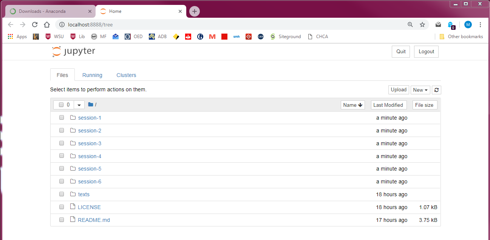

# Distant Reading

Welcome to the distant reading stream of *DH Downunder 2018*. In this github repository, you will find all the code and data you need to complete the exercises in the workshops, and to get started on your own distant reading projects.

Distant reading is the art of extracting meaning from text without actually looking at the words with your own eyes. All of us are distant readers. We interpret what texts mean according to their titles, their covers, or their authors. We use library catalogues or bibliographic databases to see what has been written on a certain topic, and to decide which texts are worth the effort of close reading.

Today distant reading is experiencing a renaissance, as advancing computer power, mass digitisation and more intelligent software allows us to query unread texts&mdash;or indeed images, sounds and videos&mdash;in ways we never could before. We hope that at the end of this series of workshops, you feel more confident to put text at a distance, and see what you can see when you step back from the canvas.

## Your instructors

* [Michael Falk](https://github.com/michaelgfalk): Developer and Research Project Manager, Digital Humanities Research Group, Western Sydney University
* [Rachel Hendery](https://www.westernsydney.edu.au/marcs/our_team/researchers/dr_rachel_hendery): Associate Professor of Digital Humanities, Western Sydney University

## Getting started

For the first two days of this workshop, you will be working in [Python](https://www.python.org/), using the [Natural Language Toolkit](https://www.nltk.org/). You will write and test your code using [Jupyter Notebooks](http://jupyter.org/). For these two days, you will need to install some software as explained below. On the final day, we will be learning how to visualise your distant reading data using [d3](https://d3js.org/).

### Step 1: Install Python 3

Before you can write any programs in the Python programming language, you need to download the Python interpreter so that your machine knows how to execute your code.

Python is open-source software, which means that it can be complex to use and install. The simplest way to install Python for this series of workshops is to use the [Anaconda distribution](https://anaconda.com), a prepackaged version of Python that already includes a number of libraries that extend Python's functionality and which we will need for this series of workshops. If you prefer to use this easier option, please [download the latest Anaconda distribution for your machine](https://www.anaconda.com/download/) and run the installer. Please use the 'Python 3.7 version' rather than the 'Python 2.7 version'.

The alternative is to download Python 3.7 'the normal way' from the [Python website](https://www.python.org/downloads/). If you choose to do this, then you will need to install some additional software afterwards, as explained in Step 2.

### Step 2: (If you did not use Anaconda) Install additional software

Once you have installed Python, you need to install some additional software the provides some useful distant reading tools. You can do this using `pip`, Python's built-in package manager.

**On Windows:** Open Command Prompt. To find Command Prompt, you can click the `Start` button or hit the <kbd></kbd> key and start typing its name. Once you have opened Command Prompt, copy and paste the following code and hit <kbd>Enter</kbd>:

```
pip install --upgrade pip
pip install numpy
pip install pandas
pip install matplotlib
pip install nltk
pip install jupyter
```

**On Mac:** Open Terminal. You will find Terminal in the 'Applications' folder. Alternatively, hit <kbd>Cmd &#8984;</kbd> + <kbd>Space</kbd> to open Spotlight, and search for Terminal by name. Once you have opened a new Terminal, copy and paste the following code and hit <kbd>Enter</kbd>:

```
pip install --upgrade pip
pip install numpy
pip install pandas
pip install matplotlib
pip install nltk
pip install jupyter
```

**On Linux:** If you run Linux, you probably aren't doing this workshop.

### Step 3: Clone (or fork) this repository

Once you have install Python, you need to download this repository, so you have all the code and data you need to participate in the workshops. To do that, click the 'clone or download' button at the top of this page. Make sure to save the folder somewhere that is easy to find. On Windows, we would recommend that you save the folder directly in your C:/ drive. On Mac, we would recommend that you save it in your root folder, which is the folder named with your username.

### Step 4: Navigate to workshop directory and open Jupyter Notebooks

Once you have installed Python and downloaded this repository, you need to fire up Python. We will be using [Jupyter Notebook](http://jupyter.org/) to write and execute our Python scripts.

**Using Anaconda:** If you have installed Anaconda, you can use 'Anaconda Navigator' to find the folder where you saved this repository and open Jupyter Notebook in it.

If you did not install Anaconda, or prefer to use the command line, then use the following instructions:

**On Windows:** Open Command Prompt. First you need to navigate to the folder where the repository is saved using the 'cd' ('change directory') command. Then should instruct your machine to open a Jupyter notebook. If you saved the repo directly in your C:/ drive, the command would be:

```
cd c:\dh-downunder-distant-reading
jupyter notebook
```

Sometimes the `jupyter notebook` command doesn't work on Windows. If it fails for you, then try this alternative: `python -m notebook`.

**On Mac:** Open a new Terminal window. First you need to navigate to the folder where the repository is saved using the 'cd' ('change directory') command. Then should instruct your machine to open a Jupyter notebook. If you saved the repo directly in your root folder, the command would be:

```
cd ~/dh-downunder-distant-reading
jupyter notebook
```

If everything worked successfully, then your default browser should open, and show a screen like this:


